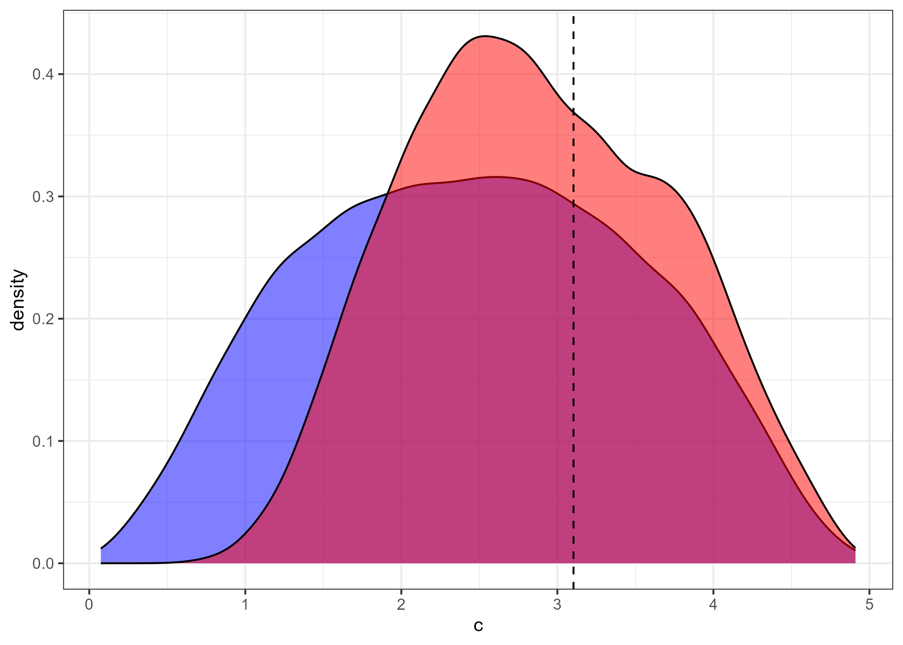

# Bayesian Categorization

The ability to form categories is essential for understanding external input and plays an important role in human reasoning and decision-making. Research of categorization have mainly focused on modeling categorization relative to individual agents, however, literature investigating groups performing this task is sparse. Humans are social beings, and studies have found superior categorization performance of groups (Tylén, Fusaroli, Smith, & Arnoldi, 2020). In this thesis, we want to extend and evaluate the generalized context model (GCM; Nosofsky, 1986) and reinforcement learning models on empirical data of interpersonal categorization. 

The analysis of the thesis is two-fold: 1) model validation and 2) model fit. Model validation includes simulating categorization behaviors from the generative models, quality check of model fit on simulated data, parameter recovery, and model recovery. Model fit includes model comparison, parameter fit, and posterior predictive checks. Scripts for running all the code can be found in the ``src/`` folder. Visualizations and inspection of the results can be reproduced by running r-markdown files in the ``res/`` folder. A more elaborate description for reproducing the results can be found below.



## Project Organization

````
├── README.md                   <- The top-level README for this project.
├── logs
├── data                        <- all data (empirical, simulated, samples)                    
├── src 
│   ├── stan                    <- stan scripts
│   ├── model_validation.sh  
│   ├── parameter_recovery.sh  
│   ├── model_recovery.sh  
│   ├── fit_models.sh   
│   └── ... 
├── res                         <- rmd-files for results and plots
├── figs                        <- figures
````

## Reproduce Results
Clone the repository
````
git clone https://github.com/saraoe/bayesian_categorization.git
cd bayesian_categorization
````

Before running any of the bash scripts:
- Install r-packages ``cmdstanr`` and run ``cmdstanr::install_cmdstanr(dir = "../")`` in an r-script
- Install r-packages ``pacman``, ``tidyverse``, ``loo``, and ``DirichletReg``
- Make directory for logs by running ``mkdir logs`` in a bash terminal

To reproduce all the results run
```
bash run.sh
```

To reproduce parts of the analysis:
- To reproduce simulate model behaviors run:
``
bash src/model_validation.sh
``

- To reproduce parameter recovery run:
``
bash src/parallel_pr.sh
``

- To reproduce model comparison run:
``
bash src/model_comparison.sh
``

- To reproduce sampling using empirical data run:
``
bash src/fit_models.sh
``

To reproduce visualization and tables, run the R-markdown files in the ``res/`` folder. Some of the scripts require the results to be gathered in one csv-files - to do so run the R-scripts ``src/gather_samples.r`` and ``src/gather_model_recovery.r``.

## References
- Nosofsky, R. M. (1986). Attention, similarity, and the identification–categorization relationship. Journal of Experimental Psychology: General.
- Tylén, K., Fusaroli, R., Smith, P., & Arnoldi, J. (2020, August). The social route to abstraction: interaction and diversity enhance performance and transfer in a rule-based categorization task.